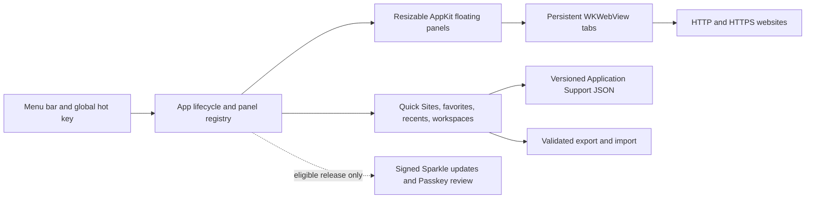

# CornerFloat

[简体中文](README.zh-CN.md) · [Contributing](CONTRIBUTING.md) ·
[Build from source](docs/SOURCE_BUILD.md) · [Roadmap](docs/ROADMAP.md) ·
[Security](SECURITY.md)

[](https://github.com/kaichen-maker/CornerFloat/actions/workflows/ci.yml)


> **Native floating web workspaces for macOS — AppKit + WebKit, no Electron,
> and no special privacy permission for core use.**

CornerFloat is an open-source, native macOS menu-bar utility that keeps
interactive websites in resizable, always-on-top panels. It is designed for
chat tools, mail, task references, and any page that should remain available
while you work elsewhere.

CornerFloat is early-stage software. The current source preview is **0.8.0
(build 11)**, and saved-data formats or internal APIs may still evolve before
1.0. There is no public signed binary or GitHub Release yet; build the current
preview from source.

## Real workflow preview

<p align="center">
  
</p>

This is a frame from a privacy-safe, real-time macOS capture—not a UI mockup.
It shows the current native WebKit panel, integrated traffic lights and address
bar, and the spacious resizable layout. The full 90-second recording is kept
outside Git so a normal clone remains small; maintainers can follow the
[GitHub publishing guide](docs/GITHUB_PUBLISHING.md#4-publish-the-real-demo)
to attach its public link here after the repository is online.

## Product preview

<p align="center">
  
  
</p>

Both images come from the current local 0.8.0 source build. The normal product
surface is a resizable always-on-top WebKit panel; these repository-safe views
show the first-run explanation and the reusable native settings surface without
including website account data.

## Why it exists

Normal browser windows disappear behind the task at hand. CornerFloat keeps the
websites you choose inside its own persistent WebKit panels so they remain
available beside the rest of your work.

It is a standalone macOS application, not a browser extension or Stage Manager
replacement.

## Highlights

- Native resizable AppKit panels with standard traffic lights and window edges.
- Configurable global show/hide shortcut (default `Shift-Command-Space`) without
  Accessibility or Input Monitoring access.
- Optional edge auto-hide, click-through, opacity, multiple displays, all Spaces,
  and full-screen auxiliary behavior.
- Smart address bar for URLs, named destinations, and Google search.
- Multiple browser tabs, persistent website sessions, upload/download, popups,
  JavaScript dialogs, and actionable failure states.
- Native Settings (`Command-,`) for launch behavior, Launch at Login, edge
  auto-hide, conflict-safe global shortcut presets, and local data portability.
- Favorites, recent destinations, and saved multi-panel workspaces.
- User-defined Quick Sites: map one or more address-bar words to any HTTP or
  HTTPS destination, then open it from the address bar or menu-bar menu.
- Native Liquid Glass on macOS 26 and system vibrancy on macOS 14-15.
- No CornerFloat account, ads, or analytics.
- Versioned JSON library export/import with preflight validation, confirmation,
  and atomic replacement; website cookies and sign-ins remain separate.

## Engineering highlights

- **Native by default:** AppKit owns the menu bar and floating window behavior;
  WebKit supplies a system browser engine without bundling Electron or Chromium.
- **Narrow permission boundary:** normal browsing, workspaces, and the global
  show/hide shortcut request no Accessibility, Screen Recording, camera, or
  microphone access.
- **Defensive browser behavior:** unsafe address-bar schemes are blocked,
  external app launches require confirmation, and failed form submissions are
  never silently replayed.
- **Data-safe boundaries:** downloads stage beside their destination and replace
  it atomically only after WebKit reports success; transient authentication
  parameters are removed before URLs enter preferences or the local library.
- **Durable local state:** versioned decoding preserves compatible favorites,
  recents, Quick Sites, and web workspaces while retired window-mirroring entries
  are safely ignored. Libraries created by a newer schema open read-only before
  evolving nested records are decoded, avoiding accidental recovery rewrites.
- **Layered verification:** pure helper checks, real loopback-only `WKWebView`
  integration tests, AppKit acceptance, lifecycle diagnostics, and release
  validators exercise different boundaries without overstating CI coverage.
- **Two-architecture release path:** formal builds compile arm64 and x86_64
  separately, combine them as Universal 2, and verify every app/Sparkle Mach-O.

## Quick start for contributors

Requirements:

- macOS 14 or later;
- Xcode or Apple Command Line Tools;
- Git, Swift Package Manager, Make, and Python 3.

```bash
git clone https://github.com/kaichen-maker/CornerFloat.git
cd CornerFloat
make bootstrap
make run
make test
make check
```

No Apple developer account is needed. `make run` creates an ad-hoc signed app at
`dist/CornerFloat.app` and opens it for local development or personal use. A
Developer ID and notarization are needed only when a maintainer distributes a
downloadable binary to other users. CornerFloat does not currently publish one.

Available commands:

```bash
make help
```

See [CONTRIBUTING.md](CONTRIBUTING.md) before opening a pull request and
[docs/ARCHITECTURE.md](docs/ARCHITECTURE.md) before changing permissions,
persistence, navigation, or updates.

## Installation behavior

CornerFloat is a menu-bar app and normally has no Dock icon. After launching,
use the CornerFloat status item to open ChatGPT, another webpage, or a saved
workspace.

Closing a red traffic-light button removes that panel. It does not terminate the
menu-bar process. Choose **Quit CornerFloat** from the menu or press `Command-Q`
while the app is active to exit completely.

For a reusable source-built copy without `sudo`, run `make install`; this places
the app in `~/Applications`. `make uninstall` removes only that app bundle and
deliberately preserves preferences, the portable library, and WebKit website
data. See [the source-build guide](docs/SOURCE_BUILD.md) for separate reset
paths.

## Keyboard shortcuts

| Action | Shortcut |
| --- | --- |
| Show or hide all panels globally | `Shift-Command-Space` by default; configurable in Settings |
| New ChatGPT panel | `Command-N` |
| Open another website | `Shift-Command-N` |
| New / close browser tab | `Command-T` / `Command-W` |
| Next / previous browser tab | `Control-Tab` / `Control-Shift-Tab` |
| Close the current panel | `Shift-Command-W` |
| Focus address bar | `Command-L` |
| Reload / back / forward | `Command-R` / `Command-[` / `Command-]` |
| Favorite current page | `Command-D` |
| Save workspace | `Option-Command-S` |
| Open Windows & Library | `Shift-Command-M` |
| Open Settings | `Command-,` |
| Compact / standard / spacious panel | `Option-Command--` / `Option-Command-0` / `Option-Command-+` |
| Quit CornerFloat | `Command-Q` |

## Permissions and privacy

| Capability | Permission | Why |
| --- | --- | --- |
| Web panels, tabs, search, Quick Sites, favorites, workspaces | None | Content runs in CornerFloat's WebKit window |
| Global show/hide shortcut | None | Uses the macOS global hot-key API and does not read typed keys |
| Launch at Login | None | Uses the macOS Login Items service only after the user changes the Settings switch |
| Website passkeys in an eligible signed release | Passkeys Access for Web Browsers, on demand | The menu appears only when the app contains the matching release provisioning profile |

CornerFloat does not use the camera or microphone. Quick Sites, favorites,
recents, and workspace layouts stay under the current macOS user's Application
Support directory. Settings can export or import that library as inspectable
JSON; WebKit manages site cookies and sessions separately and they are never
included in the export.

Read [PRIVACY.md](PRIVACY.md) for the complete policy.

## Website compatibility

Google prohibits OAuth authorization inside application-controlled embedded
browsers, and Microsoft or an organization may impose a similar restriction.
CornerFloat no longer preemptively cancels ChatGPT's Google redirect: WebKit may
attempt the flow in place with a truthful `CornerFloat/<version>` product token,
a visible URL, and native connection-security information. It neither claims to
be another browser nor rewrites authentication requests. Google may still reject
the session under its policy; **More → Open in Default Browser** remains the
supported fallback, and browser cookies are not copied back into CornerFloat.

Passkey support also depends on the site, account, macOS, WebKit, and a public
build signed with an Apple-approved Web Browser Public Key Credential managed
entitlement. An ad-hoc development build can test CornerFloat's authorization
logic but is not an end-to-end cross-site passkey acceptance artifact.

## Architecture at a glance



The diagram shows ownership rather than every callback. Read the
[architecture guide](docs/ARCHITECTURE.md) for navigation, persistence, and
release trust boundaries, and the
[window-mirroring decision record](docs/decisions/0001-web-workspaces-without-window-mirroring.md)
for the product and permission trade-off behind the current web-only scope.

## Repository map

```text
Sources/CornerFloat/   AppKit, WebKit, persistence, and update code
Tests/                 Focused helper and real local WebKit integration tests
Resources/             Info.plist, icon, privacy and support pages
scripts/               Build, test, package, diagnostics, and release validation
docs/                  Architecture, roadmap, lifecycle, and release guidance
.github/                CI and contribution templates
```

The only Swift package dependency is pinned to Sparkle 2.9.4. Third-party terms
are listed in [THIRD_PARTY_NOTICES.md](THIRD_PARTY_NOTICES.md).

## Testing and releases

`make test` is the reproducible contributor suite. `make check` also compiles
with complete Swift concurrency checking and warnings as errors. `make acceptance` additionally
opens AppKit windows and exercises the global shortcut and lifecycle diagnostics
from a logged-in desktop.

Physical display changes, system sleep, account sign-in, passkeys, Developer ID
signing, notarization, and update installation require the manual
evidence described in [docs/RELEASE_CHECKLIST.md](docs/RELEASE_CHECKLIST.md).

No public binary has been released yet. The optional public-release path requires
the maintainer's Apple and Sparkle credentials. Forks can build and modify the
app freely under MIT, but must use their own bundle identity, signing certificate,
update keys, and download feed before distributing binaries. A provisioning
profile is required only when a fork opts into an Apple-approved managed
entitlement such as the optional cross-site Passkey capability.

## Known limits

- Click-through makes a whole panel ignore the pointer until disabled from the
  menu-bar menu.
- Reduced Transparency replaces glass with a clearer system background.

## Community and license

The project uses a maintainer-led governance model. Focused contributions are
welcome; see [GOVERNANCE.md](GOVERNANCE.md), the
[Code of Conduct](CODE_OF_CONDUCT.md), and the public
[roadmap](docs/ROADMAP.md).

CornerFloat source code is available under the [MIT License](LICENSE). Sparkle
and its bundled components retain their own license notices.
