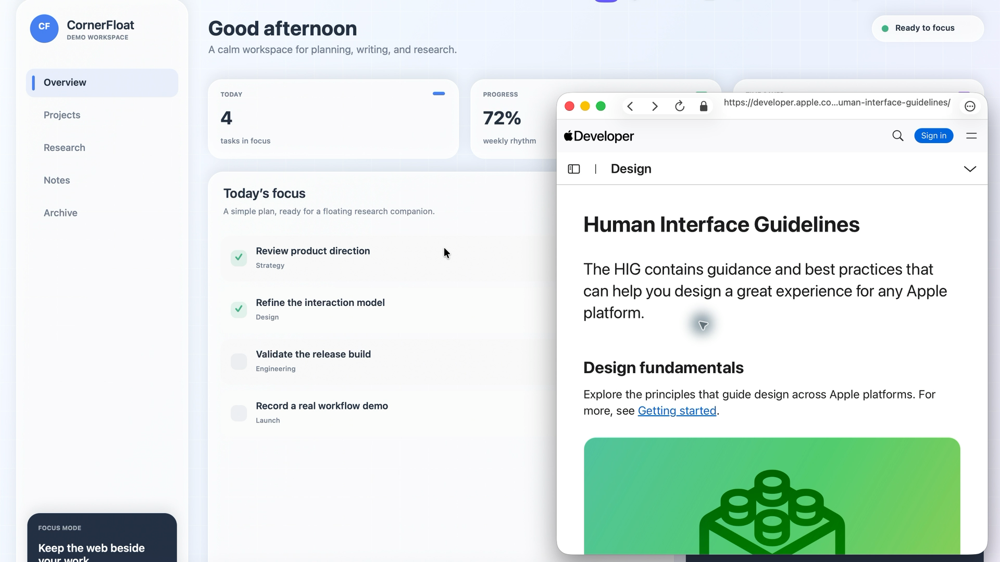
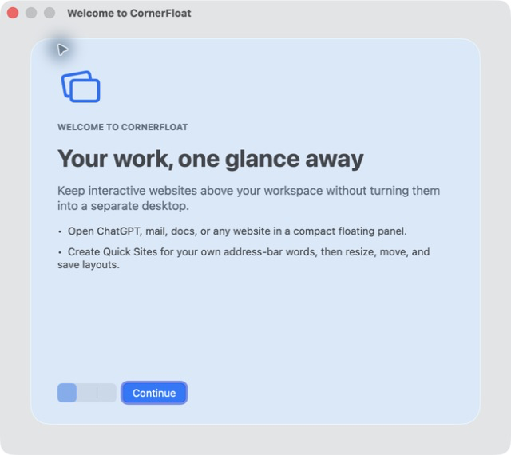
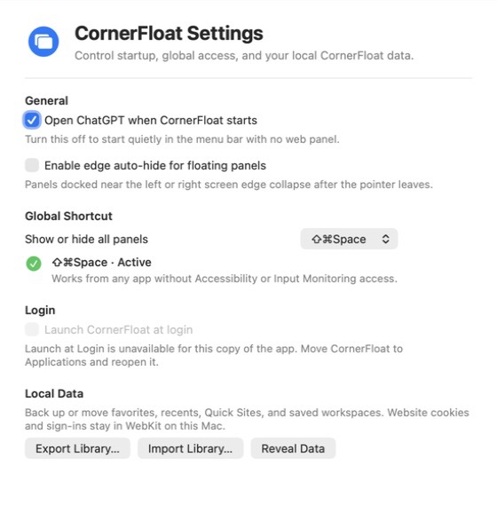

# CornerFloat 0.8.0

[English README](README.md) · [参与贡献](CONTRIBUTING.md) ·
[安装源码版](docs/SOURCE_BUILD.md) · [路线图](docs/ROADMAP.md) · [安全政策](SECURITY.md)

> CornerFloat 正在以开源优先的方式开发。目前仍属于 1.0 之前的早期版本，欢迎提交聚焦的错误修复、测试、文档与 macOS 体验改进。

> 当前仓库是 0.8.0（build 11）源码预览。项目尚未发布可公开下载的签名二进制或 GitHub Release；目前请从源码构建使用。

CornerFloat 是一个原生 macOS 菜单栏应用：它把可交互网页放进始终置顶的浮动面板，让 ChatGPT、邮件、文档和参考资料随时可见。

它不是浏览器扩展，也不是“台前调度”或辅助触控。网页直接运行在 CornerFloat 自己的 WebKit 窗口中，并保留独立的标签页、网站数据和窗口状态。

最低运行版本为 macOS 14。界面语言为英文。

## 普通用户：从源码安装并使用

CornerFloat 目前还没有经过 Developer ID 签名和 Apple 公证的一键下载版。
GitHub 绿色 **Code → Download ZIP** 按钮下载的是源码，不是可以直接双击的
`CornerFloat.app`。不过，你仍然可以在支持的 Mac 上自行构建并安装个人使用版，
不需要 Apple 开发者账号、管理员密码或 `sudo`。

### 需要准备

- macOS 14 或更高版本的 Mac；
- 首次下载依赖时可用的网络连接；
- Xcode 15 或更高版本，或者包含 Swift 5.9 及以上版本的 Apple 免费 Command Line Tools；
- 大约 1 GB 可用空间，用于源码、依赖和构建缓存。

如果尚未安装开发工具，打开 Mac 的 **终端**，运行下面的命令，完成 Apple 弹出的
安装步骤后再继续：

```bash
xcode-select --install
```

### 方法一：从网页下载 ZIP

1. 在当前 GitHub 仓库页面点击 **Code → Download ZIP**。
2. 打开下载的 ZIP，得到源码文件夹；它通常叫作 `CornerFloat-main`。
3. 打开 Mac 的 **终端**。
4. 在终端输入 `cd `，注意 `cd` 后面保留一个空格；把刚才的源码文件夹拖进
   终端窗口，然后按回车。
5. 依次运行：

```bash
make bootstrap
make install
open "$HOME/Applications/CornerFloat.app"
```

### 方法二：使用 Git

```bash
git clone https://github.com/kaichen-maker/CornerFloat.git
cd CornerFloat
make bootstrap
make install
open "$HOME/Applications/CornerFloat.app"
```

`make bootstrap` 会检查当前 Mac，并下载固定版本的 Swift 依赖；`make install`
会为当前 Mac 构建 CornerFloat、进行本地 ad-hoc 签名，然后把应用安装到
`~/Applications/CornerFloat.app`。
首次构建可能需要几分钟。终端显示
`Installed CornerFloat at .../Applications/CornerFloat.app` 即表示安装完成。

CornerFloat 是菜单栏应用，正常运行时不会出现在 Dock。打开后，请在屏幕顶部菜单栏
寻找 CornerFloat 图标；从这个菜单可以打开 ChatGPT、其他网页或保存的工作区。
如需完全退出，请从菜单中选择 **Quit CornerFloat**，或者在 CornerFloat 处于活动状态时
按 `Command-Q`。

源码安装版包含核心浮窗、标签页、网页浏览、Quick Sites、收藏和保存的工作区，
但不包含正式发行版专用的自动更新通道和 Apple 批准的跨网站 Passkey 权限。
部分 OAuth 服务也可能根据自己的政策要求通过 **More → Open in Default Browser** 登录。

### 只想先体验，不安装

在源码文件夹中运行：

```bash
make bootstrap
make run
```

这会构建并直接打开 `dist/CornerFloat.app`，但不会把它安装到
`~/Applications`。

### 更新或卸载源码安装版

请先完全退出 CornerFloat。如果保存的资料库很重要，建议更新这个早期版本前先从
Settings 导出备份。如果最初使用 Git 克隆，请回到 `CornerFloat` 文件夹运行：

```bash
git pull --ff-only
make bootstrap
make install
open "$HOME/Applications/CornerFloat.app"
```

如果最初使用 **Download ZIP**，请重新下载最新 ZIP，在新的源码文件夹中再次运行
`make bootstrap` 和 `make install`。

要删除已安装的应用，请先在 Settings 关闭 **Launch at Login**，然后完全退出
CornerFloat，再在源码文件夹中运行：

```bash
make uninstall
```

这会保留偏好、保存的工作区和网站登录会话。如果源码文件夹已经删除，也可以在 Finder
中打开当前用户的 `Applications` 文件夹，把 `CornerFloat.app` 移到废纸篓。

如果命令执行失败，请先查看输出中的第一条 `FAIL`、`error:` 或 `fatal:`。最常见原因是
系统低于 macOS 14、Command Line Tools 尚未安装完成，或者首次下载依赖时网络中断。
如果应用已经打开却没有出现窗口，请查看屏幕顶部菜单栏；CornerFloat 本来就是菜单栏应用。

遇到问题时，请查看[从源码构建指南](docs/SOURCE_BUILD.md)，其中包含独立的数据重置说明。

## 真实工作流预览

<p align="center">
  
</p>

这张图来自隐私安全的 macOS 实时操作录屏，不是 UI 效果图。它展示了当前真实的 WebKit 浮动面板、一体化交通灯和地址栏，以及可自由缩放的宽屏布局。完整 90 秒视频不直接提交进 Git，以免仓库体积膨胀；仓库上线后可按照 [GitHub 发布指南](docs/GITHUB_PUBLISHING.md#4-publish-the-real-demo)上传视频并把公开链接接入 README。

## 产品预览

<p align="center">
  
  
</p>

两张图片均来自当前本地 0.8.0 源码构建；为避免公开网站账户信息，这里展示首次引导与可复用的原生设置窗口。实际核心界面是可自由缩放、始终置顶的 WebKit 网页面板。

## 0.8.0 主要功能

### 随时可用的浮动工作区

- 默认按 `Shift-Command-Space`（`⇧⌘Space`）可从任何应用全局显示或隐藏全部面板；可在 Settings 中选择其他预设，冲突时会安全恢复原快捷键，且不需要辅助功能或输入监控权限。
- 可选 **Edge Auto-Hide**：面板停靠到屏幕左侧或右侧后自动收起，光标移回屏幕边缘即可展开。
- 面板使用真正的 macOS 窗口边缘和角落，可自由拖动缩放；也可选择 Compact、Standard、Spacious 三种尺寸。
- 每个面板可单独调整透明度、点击穿透、显示状态和边缘自动收起。
- 面板可跨多个显示器使用，并加入所有 Spaces；进入全屏应用时可作为辅助浮窗继续显示。
- 显示器连接关系改变时，移出有效屏幕的面板会被带回可见区域。

### 更完整的网页体验

- 地址栏同时支持网址、网站名称和普通搜索文字。
- 输入 `Google`、`ChatGPT` / `Chat GPT` 或 `Gmail` 可直接进入对应网站；`UniMail`、中文问题等不明确内容会使用 Google 搜索。
- 可在 **Windows & Library → Quick Sites** 新增自己的快捷网站。例如把 `UniMail`、`校园邮箱` 指向学校邮箱；之后在任意 CornerFloat 地址栏输入其中一个快捷词即可直接打开。快捷网站支持新增、编辑、删除和菜单栏快速启动，并只保存在本机。
- `example.com` 会自动补全 `https://`；`localhost:3000` 等本地开发地址会使用 `http://`。
- 每个网页面板支持多个标签页，`⌘T` 新建标签页，`⌘W` 关闭当前标签页。
- CornerFloat 声明可接收 HTTP/HTTPS 链接，以满足系统浏览器 Passkey 能力要求；从其他应用发送来的网页会优先在现有 CornerFloat 面板的新标签中打开。它不会擅自把自己设为系统默认浏览器。
- 使用 WebKit 的持久网站数据存储，同一 macOS 用户中的 Cookie 和登录会话可在后续启动中继续使用。
- 网站弹出的 OAuth 窗口会在新标签页中打开。CornerFloat 不再预先取消 ChatGPT 的 Google 登录跳转；它使用 WebKit 自己生成的 user-agent 并追加真实的 `CornerFloat/<version>` 产品标识，不伪装成 Safari、Chrome 或其他浏览器，也不改写认证请求。工具栏会持续显示当前网址，并提供可点击的连接安全信息。[Google 的当前政策](https://developers.google.com/identity/protocols/oauth2/policies#secure-browsers)仍可能拒绝 `WKWebView` 中的 OAuth；若服务方实际拒绝，可从 **More → Open in Default Browser** 继续。默认浏览器与 CornerFloat 的 Cookie 会话彼此独立。
- Passkey 由 macOS、AuthenticationServices 与 WebKit 的系统流程处理。只有符合条件的正式签名版本才显示 **Enable or Review Passkey Access…**；它不会在启动时弹出授权。源码构建隐藏该入口，普通网页和密码登录不受影响。
- 网页上传会打开原生文件选择器；下载会先询问保存位置，并显示完成或失败结果。
- 下载先写入目标目录中的独立临时文件，只有 WebKit 报告成功后才原子替换目标；失败、取消或关闭面板不会提前删除已有文件。
- DNS、离线、超时、TLS 证书、HTTP、身份验证和 Web Content 进程错误会显示可操作说明。只有保留了完整 GET/HEAD 请求且没有 body 时才允许重试；POST、表单重提交和不安全的历史/刷新请求不会被静默重放。
- `javascript:`、`file:`、`data:` 等来自地址栏的非网页协议不会被载入；外部协议在打开其他应用前会要求确认。

> CornerFloat 会先让 Google 登录在原面板中正常继续，不再自行拦截。如果 Google 针对该账户或会话返回 `disallowed_useragent`，默认浏览器仍是服务方唯一支持的回退；其中的 HttpOnly Cookie 不会被复制回 CornerFloat。

### 快捷网站、收藏、最近使用与保存的工作区

- **Favorites** 保存常用页面。
- **Recent Destinations** 记录最近访问的网页，可单独删除或清空。
- **Saved Workspaces** 保存一组网页面板的布局，并恢复标签页、当前标签、位置、尺寸、显示状态、透明度、点击穿透和边缘自动收起设置。
- **Windows & Library…** 提供统一的原生管理窗口；保存的工作区可以恢复为多面板布局。
- 这些数据只保存在当前 macOS 用户账户的 `~/Library/Application Support/CornerFloat`。
- URL 写入偏好或资料库前会移除用户信息、片段和常见的 OAuth 临时参数，并拒绝异常过长的地址；未来版本资料库会在解析内部记录前先进入只读模式。
- Settings 可把资料库导出为可检查的 JSON，也可在完整校验和预览后确认替换导入；无效或未来版本文件不会改写现有数据，网站 Cookie 与登录会话不会进入导出文件。

### 原生 Mac 体验

- 交通灯、导航按钮、地址栏和网页内容位于同一个原生窗口中，窗口边缘可像普通浏览器一样缩放。
- macOS 26 使用系统 Liquid Glass；macOS 14–15 使用系统半透明材质回退。
- 首次启动提供三页英文引导，解释浮动网页、全局快捷键，以及红色关闭按钮与 `⌘Q` 的区别；关闭引导不会意外打开 ChatGPT。
- 原生 **Settings…**（`⌘,`）统一管理启动时打开 ChatGPT、登录后自动启动、边缘自动收起、可配置的全局快捷键，以及资料库导入导出。
- 使用正式应用图标、完整的英文应用菜单、菜单栏入口，以及内置 Privacy Policy 和 Support 页面。
- 正式发行版使用 Sparkle 自动检查并安装签名更新；本地开发构建不会连接未配置的更新源。

## 如何退出

- 完全退出：点菜单栏 CornerFloat 图标，选择 **Quit CornerFloat**，或在 CornerFloat 处于活动状态时按 `⌘Q`。
- 红色关闭按钮、**Close Panel** 或关闭最后一个标签页只会移除对应面板；应用会继续留在菜单栏。
- `⇧⌘Space` 只切换全部面板并保留会话；标准 `⌘H` 会隐藏整个 CornerFloat 应用，不会退出进程。

这种行为与其他菜单栏工具一致：关闭窗口和退出应用是两件不同的事。

## 常用快捷键

| 操作 | 快捷键 | 作用范围 |
| --- | --- | --- |
| 显示 / 隐藏全部面板 | 默认 `⇧⌘Space`，可在 Settings 修改 | 全局，其他应用在前台时也有效 |
| 新建 ChatGPT 面板 | `⌘N` | CornerFloat |
| 打开其他网页 | `⇧⌘N` | CornerFloat |
| 新建标签页 | `⌘T` | 当前网页面板 |
| 关闭当前标签页 | `⌘W` | 当前网页面板 |
| 下一个 / 上一个标签页 | `⌃Tab` / `⌃⇧Tab` | 当前网页面板 |
| 关闭当前面板 | `⇧⌘W` | 当前面板 |
| 聚焦地址栏 | `⌘L` | 当前网页面板 |
| 重新载入 | `⌘R` | 当前网页面板 |
| 后退 / 前进 | `⌘[` / `⌘]` | 当前网页面板 |
| 收藏当前页面 | `⌘D` | 当前网页面板 |
| 保存当前工作区 | `⌥⌘S` | CornerFloat |
| 打开 Windows & Library | `⇧⌘M` | CornerFloat |
| 打开设置 | `⌘,` | CornerFloat |
| 缩小 / 标准 / 放大面板 | `⌥⌘-` / `⌥⌘0` / `⌥⌘+` | 当前面板 |
| 最小化当前面板 | `⌘M` | 当前面板 |
| 隐藏 CornerFloat | `⌘H` | CornerFloat |
| 退出 CornerFloat | `⌘Q` | CornerFloat |

## 权限说明

| 功能 | 所需权限 | 原因 |
| --- | --- | --- |
| 网页、ChatGPT、搜索、快捷网站、收藏、工作区 | **无特殊权限** | 网页直接显示在 CornerFloat 自己的 WebKit 窗口中 |
| 全局 `⇧⌘Space` | **无特殊权限** | 通过 macOS 全局快捷键 API 注册，不读取键盘内容 |
| 网站 Passkey（可选正式发行能力） | **Passkeys Access for Web Browsers（按需）** | 只有带匹配 provisioning profile 的正式构建才显示授权入口；源码构建不会显示不可用菜单 |

网页面板不需要特殊的 macOS 隐私权限。源码构建也不需要 Passkey 特殊授权，并会隐藏不可用的 Passkey 和自动更新菜单。

> 系统授权逻辑已经接通，但可跨任意网站使用 Passkey 的正式发行版还必须由 Apple 为开发者团队批准 `com.apple.developer.web-browser.public-key-credential` managed entitlement，以该团队的 Developer ID 正式签名，并嵌入匹配、未过期的 Developer ID distribution provisioning profile。源码构建会隐藏这个不可用入口；自动测试仍会验证授权状态逻辑，但不能作为真实跨站 Passkey 验收结果。

CornerFloat 不会调用摄像头或麦克风。

## 多屏、Spaces 与能耗

- 面板采用 `canJoinAllSpaces` 和 `fullScreenAuxiliary` 行为，可随用户切换桌面并配合全屏应用使用。
- 面板尺寸和位置始终按当前显示器的可见区域约束；断开显示器或唤醒后会重新校正。
- 可重复的窗口生命周期、模拟拔屏重定位与空闲 CPU 验收见 [Lifecycle, display and energy verification](docs/LIFECYCLE_AND_ENERGY_TESTING.md)。真实双屏和系统睡眠仍按该清单人工验收。

## 隐私、支持与更新

- CornerFloat 不提供账户、广告或分析服务。
- Quick Sites、Favorites、Recents、Saved Workspaces 和偏好保存在本机。
- 网页流量、登录和上传由你打开的网站处理，并受该网站隐私政策约束。
- WebKit 在本机保存网站 Cookie 与会话；下载只写入你在保存面板中选择的位置。
- 可从应用菜单打开 **Privacy Policy** 和 **CornerFloat Support**。Support 页面可复制不含凭据的版本、系统和架构诊断信息。
- 删除快捷网站、收藏、最近访问和工作区：退出 CornerFloat 后移除 `~/Library/Application Support/CornerFloat`。偏好由 macOS 另行保存；完全重置偏好需在退出后运行 `defaults delete com.calvinkai.cornerfloat`。WebKit Cookie 与网站数据也独立于这两者。
- 正式发行版默认每天检查一次 HTTPS Sparkle 更新源，也可手动选择 **Check for Updates…**。开发构建若未注入签名更新源，会明确显示更新未配置。

另见 [PRIVACY.md](PRIVACY.md) 与 [SUPPORT.md](SUPPORT.md)。

## 开源协作

项目采用维护者主导的协作方式，并公开记录架构边界、路线图和安全披露流程：

- [CONTRIBUTING.md](CONTRIBUTING.md)：环境准备、代码规范、测试层级和 Pull Request 要求；
- [docs/SOURCE_BUILD.md](docs/SOURCE_BUILD.md)：无需 Apple 开发者账号的构建、运行和功能范围；
- [docs/ARCHITECTURE.md](docs/ARCHITECTURE.md)：组件归属，以及权限、导航、持久化和更新的安全边界；
- [docs/ROADMAP.md](docs/ROADMAP.md)：当前重点、适合首次贡献的任务和暂不支持的方向；
- [SECURITY.md](SECURITY.md)：漏洞的私下报告方式；
- [GOVERNANCE.md](GOVERNANCE.md) 与 [CODE_OF_CONDUCT.md](CODE_OF_CONDUCT.md)：决策方式和社区行为规范；
- [CHANGELOG.md](CHANGELOG.md)：按版本记录值得关注的变化。

快速检查并准备本地环境：

```bash
make bootstrap
make check
```

运行 `make help` 可以查看所有统一开发命令。提交代码前请确认没有包含账户信息、Cookie、签名证书、私钥或 provisioning profile。

## 自行构建和测试

需要 macOS 14 或更高版本，以及支持 Swift Package Manager 的当前 Xcode 或 Apple Command Line Tools。项目使用 Swift 5.9 工具格式，并固定依赖 Sparkle 2.9.4。

```bash
./scripts/swiftpm.sh resolve
./scripts/test.sh
```

`scripts/test.sh` 会构建应用、运行核心自检、纯函数浏览器测试，并用仅绑定 `127.0.0.1` 的临时 HTTP fixture 驱动真实 `WKWebView`，验证跨标签持久 Cookie、`window.open`/`opener`、JavaScript 对话框、上传、下载、GET 重试、POST 防重放和 Web Content 进程终止后的恢复状态；测试结束会删除测试 Cookie 和临时下载。只构建应用可运行：

```bash
./scripts/build.sh
```

在已登录的 macOS 图形桌面上运行发行候选验收：

```bash
./scripts/acceptance-tests.sh
```

这项验收会以超时保护运行真实 Carbon 全局快捷键回调、AppKit 面板与菜单冒烟测试、Spaces/全屏辅助行为、显示器和睡眠/唤醒通知、贴边收起、隐藏/恢复/最小化/关闭，以及生命周期 JSON 和空闲 CPU 采样。它不替代真实双屏、系统睡眠或干净 Mac 上的人工验收。

运行真实 AppKit 窗口生命周期与空闲能耗诊断：

```bash
./scripts/lifecycle-diagnostics.sh
```

生成本地 DMG：

```bash
./scripts/package-dmg.sh
```

在没有 Developer ID、Apple 公证凭据或 GitHub 仓库时，也可以完整演练 Sparkle 的旧版到新版更新：

```bash
./scripts/sparkle-e2e-test.sh
```

这项隔离测试会在受限临时目录中生成一次性 Ed25519 种子，构建旧版与当前新版，用仅绑定 `127.0.0.1` 的临时 HTTP feed 调用 Sparkle 2.9.4 自带的 `sparkle-cli`，并实际完成版本选择、下载、EdDSA 验签、解压和替换安装。`sparkle-cli` 不会通过 `--feed-url` 覆盖配置，而是直接读取测试应用包内的 `SUFeedURL` 和 `SUPublicEDKey`。测试还会篡改一份 ZIP，确认错误签名被拒绝。它不会调用 `generate_keys`、不会修改 Keychain，Sparkle 缓存和用户默认值也会被重定向到临时目录；退出时始终删除私钥和测试产物。

临时 HTTP 只在 `ALLOW_INSECURE_LOCAL_UPDATE_TEST=1` 且地址是带显式端口的 loopback 主机时，才会向该临时应用注入 Sparkle 的 `SUAllowsInsecureUpdate`。正式 Info.plist 模板和普通构建都必须没有这个键；`release.sh` 也会在签名和发布前明确拒绝任何包含它的应用。

这个演练证明应用内 Sparkle 接线及更新包信任链可以工作，但不能替代 Developer ID、Hardened Runtime、Apple 公证、正式 HTTPS feed 或上一公开版本在干净 Mac 上的最终验收。

默认构建使用 ad-hoc 临时签名，不包含公开 Sparkle feed。正式 Developer ID 签名、公证、DMG 和 appcast 流程见 [docs/RELEASE_CHECKLIST.md](docs/RELEASE_CHECKLIST.md)。

## 技术结构

- Swift + AppKit：菜单栏应用、窗口和原生菜单
- WebKit：多标签网页、持久登录、OAuth 弹窗、Passkey、上传与下载
- AuthenticationServices：Passkeys Access for Web Browsers 状态检查与用户触发的系统授权
- Carbon Hot Key API：无需 Accessibility 的全局快捷键
- Sparkle 2：签名自动更新
- Swift Package Manager：依赖和构建

## 已知边界

- Google OAuth 政策可能拒绝 `WKWebView` 认证，Microsoft 或企业租户也可能施加类似限制。CornerFloat 不会提前阻断登录，也不会伪装其他浏览器或复制登录 Cookie；最终是否接受仍由服务方决定。
- Passkey 是否可用取决于网站、macOS、WebKit、账户配置，以及正式构建是否带有 Apple 已批准的 Web Browser Public Key Credential managed entitlement。
- 点击穿透会让整个面板忽略鼠标；需从菜单栏关闭后才能再次拖动或缩放。
- macOS 开启“降低透明度”时，界面会改用更清晰的系统背景。

## License

CornerFloat 源代码采用 [MIT License](LICENSE)。在 GitHub 发布源码、Fork、修改和本机运行均不需要 Apple 开发者账号。只有向其他用户分发正式二进制的维护者才需要自己的 Developer ID；只有提供自动更新时才需要自己的更新密钥。Sparkle 及其内含组件保留各自的许可声明，详见 [THIRD_PARTY_NOTICES.md](THIRD_PARTY_NOTICES.md)。
